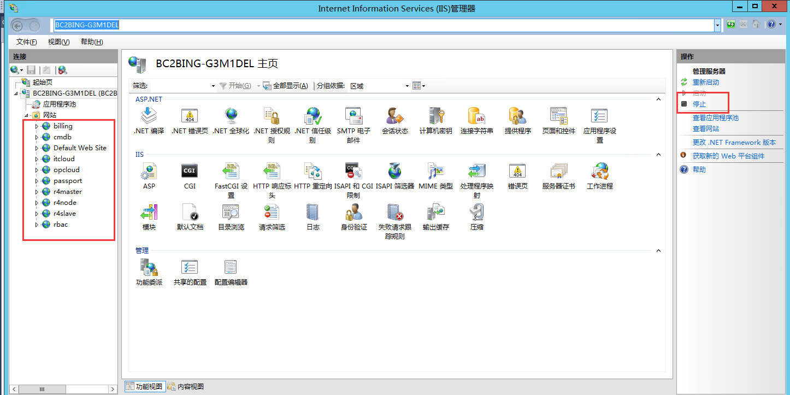
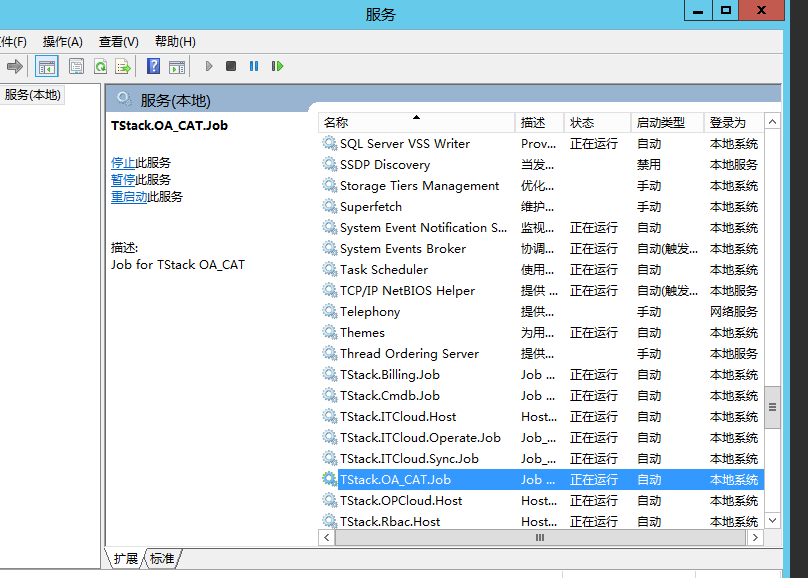
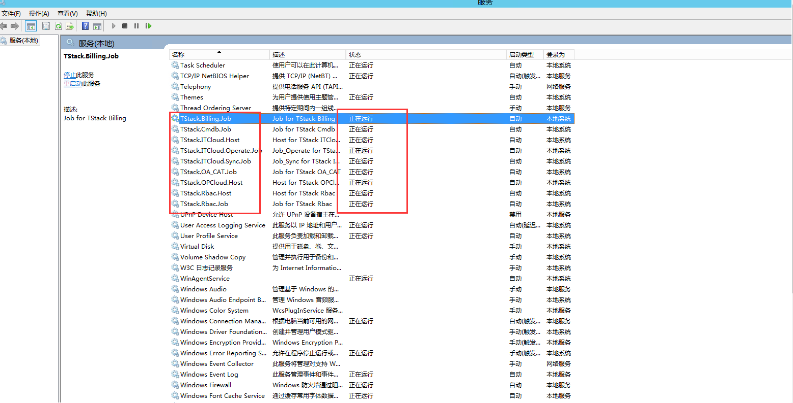

Tstack自助云平台恢复手册
---

[TOC]

# 停止服务
## 停止sip服务器服务(windows服务器)
所有服务如下表

|web|job|host|
|:---:|:---:|:--:|
|itcloud|TStack.ITCloud.Operate.Job  TStack.ITCloud.Sync.Job|TStack.ITCloud.Host|
|billing|TStack.Billing.Job|-|
|cmdb|TStack.Cmdb.Job|-|
|opcloud|-|TStack.OPCloud.Host|
|passport|-|-|
|r4master|-|-|
|r4node|-|-|
|r4slaver|-|-|
|rbac|TStack.Rbac.Job|TStack.Rbac.Host|
|-|TStack.OA_CAT.Job|-|
### Web服务
如下图左侧的网站都需要停止，点右侧停止  


### 停止host以及job服务
按照上表，将所有的job以及host服务停止
dos命令行调出服务管理
```dos
services.msc
```
右键停止


## 备份SQLserver数据库并停止数据库引擎
### 备份数据库
数据库分别为billing itcloud cmdb itcloud_bz oa_cat rbac opcloud，进行全量备份
### 停止引擎
在MSsql Management studio里面右键数据库引擎然后stop
## 停止venus服务、rabbitmq服务、mysql服务（linux服务器）
### 停止venus
托管在supervisor中
```bash
supervisorctl stop venus_api venus_compute venus_database
```
未托管在守护进程中
```bash
cd /data/venus && ./stop.sh RegionName
# 或者
ps -ef|grep venus|grep -v grep|awk '{print $2}'|xargs kill -9
```
### 停止rabbitmq服务
先备后主
```bash
service  rabbitmq-server stop
```
### 停止mysql服务
备份数据库服务
```bash
mysqldump -B venus > /data/backup
```
停止数据库服务先备后主
```bash
service mariadb restart
```
# 恢复验证服务
## 恢复venus、rabbitmq、mariadb等服务
### 恢复venus
托管在supervisor中
```bash
supervisorctl start venus_api venus_compute venus_database
```
未托管在守护进程中

```bash
cd /data/venus && ./start.sh RegionName
```
### 验证venus
```bash
ps -ef|grep venus
##有6个venus相关输出则正常
```
### 恢复mariadb
```bash
#先主后从
service mariadb start
```
### 验证服务
```bash
clustercheck
#输出200 OK则正常
```

### 恢复rabbitmq
```bash
#先主后从
service rabbitmq-server restart
```
### 验证 rabbitmq
```bash
rabbitmqctl cluter_status
```

## sip服务器恢复服务(windows服务器)
### 恢复job host web服务
按照停止服务类似办法恢复
下图即恢复正常状态

### web恢复
与停止web服务相似，iis界面点击web网站`启动`即可启动web
### SQLserver恢复
在MSsql Management studio里面右键数据库引擎然后stop

到此为止，所有服务恢复完毕
# 验证
登陆`sip.cloud.local` `op.cloud.local`测试基本功能是否可用，如可用则恢复成功
