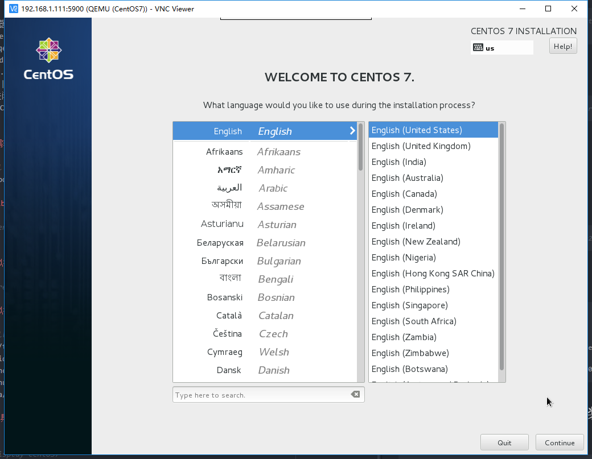

>NOTE: ‘#’开头的是root权限执行的命令   
‘virsh #’开头的是virsh命令行下执行的命令

# 1.环境说明
## 1.1硬件环境
|项目|版本|
|:-:|:-:|
|服务器类型|VMware虚拟机|
|服务器系统|CentOS7.1|
|服务器网络|桥接模式|
|服务器IP|192.168.1.111|
## 1.2软件环境
|项目|版本|
|:-:|:-:|
|hypervisor|qemu-kvm-1.5.3-141.el7_4.4|
|镜像网络模式|Bridge|
|镜像版本|CentOS7.1|
|VNC客户端|VNC-Viewer-6.17.1113-Windows-64bit|

# 2.环境搭建
## 2.1 软件安装
安装kvm
```bash
# yum install -y qemu-kvm libvirt libvirt-python  \
libguestfs-tools virt-install
```
启动服务
```bash
# systemctl enable libvirtd && systemctl start libvirtd
```
## 2.2网络设置
由于我用的是VMware虚拟机，启动的镜像也采用bridge模式会使后续的远程连接调试更加方便  
添加网桥br0需修改ifcfg-ens33与ifcfg-br0(dhcp模式),配置如下:
```bash
# cat /etc/sysconfig/network-scripts/ifcfg-ens33
TYPE="Ethernet"
DEVICE="ens33"
ONBOOT="yes"
BRIDGE="br0"
```
```bash
# cat /etc/sysconfig/network-scripts/ifcfg-br0
TYPE="bridge"
BOOTPROTO="dhcp"
DEVICE="br0"
ONBOOT="yes"
```
## 3.镜像制作
## 3.1创建磁盘(创建将来的Openstack镜像)
```bash
# qemu-img create -f qcow2 /tmp/CentOS7.qcow2 30G
```
## 3.2启动镜像
```bash
# virt-install --name CentOS7 --ram 1024 \
--disk path=/tmp/CentOS7.qcow2  \
--network bridge=br0  \
--graphics vnc,listen=0.0.0.0 --noautoconsole \
--os-type=linux --os-variant=rhel7  \
--cdrom=/data/img/CentOS-7-x86_64-Minimal-1503-01.iso
##cdrom后面的镜像需要从CentOS官网下载
```
## 3.3连接vnc进行系统安装系统初始化
查看vnc端口
```bash
virsh # vncdisplay CentOS7
:0
```
外部连接的vnc端口为590x例如上面就为5900，以192.168.1.111:5900连接之后进行安装系统
    
安装完系统之后进行系统之后重启镜像进行初始化操作，例如:
- 安装常用软件vim、unzip、net-tools等
- 配置调优，例如禁用sshd的dns选项
- 安装agent
- 更个性化的定制可能需要cloud-init

## 3.4清除镜像信息(mac地址等)
```bash
# virt-sysprep -d centos
```
清除完之后关闭虚拟机，上传镜像
# 4.镜像上传(Kilo)
先把/tmp/CentOS7.qcow2拷贝到glance服务器
```bash
# glance image-create --name 'CentOS7' \
--file=/root/img/Centos7.qcow2  \
--disk-format qcow2 --container-format bare \
--is-public=true
```
