>NOTE: ‘#’开头的是root权限执行的命令   
‘virsh #’开头的是virsh命令行下执行的命令

# 1.环境说明
## 1.1硬件环境
|项目|版本|
|:-:|:-:|
|服务器类型|VMware虚拟机|
|服务器系统|CentOS7.1|
|服务器网络|桥接模式|
|服务器IP|192.168.1.111|
|磁盘空间|40G|
***注：磁盘空间尽量大一点，windwos占空间比最小化安装的linux大很多***
## 1.2软件环境
|项目|版本|
|:-:|:-:|
|hypervisor|qemu-kvm-1.5.3-141.el7_4.4|
|镜像网络模式|Bridge|
|Windows镜像版本|windows_server_2012 r2|
|驱动镜像版本|virtio-win-0.1.141|
|VNC客户端|VNC-Viewer-6.17.1113-Windows-64bit|
由于windows没有自带的驱动可以检测opentack磁盘以及网络，所以需要用virtio驱动  
virtio镜像下载地址 https://fedorapeople.org/groups/virt/virtio-win/direct-downloads/archive-virtio/virtio-win-0.1.141-1/virtio-win-0.1.141.iso
# 2.环境搭建
## 2.1 软件安装
安装kvm
```bash
# yum install -y qemu-kvm libvirt libvirt-python  \
libguestfs-tools virt-install
```
启动服务
```bash
# systemctl enable libvirtd && systemctl start libvirtd
```
## 2.2网络设置
由于我用的是VMware虚拟机，启动的镜像也采用bridge模式会使后续的远程连接调试更加方便  
添加网桥br0需修改ifcfg-ens33与ifcfg-br0(dhcp模式),配置如下:
```bash
# cat /etc/sysconfig/network-scripts/ifcfg-ens33
TYPE="Ethernet"
DEVICE="ens33"
ONBOOT="yes"
BRIDGE="br0"
```
```bash
# cat /etc/sysconfig/network-scripts/ifcfg-br0
TYPE="bridge"
BOOTPROTO="dhcp"
DEVICE="br0"
ONBOOT="yes"
```
修改完网卡配置需要重启网络服务
```bash
# systemctl restart network
或者
# systemctl restart NetworkManager
重启那个服务取决于你使用那个服务
```
## 3.镜像制作
## 3.1创建磁盘(创建将来的Openstack镜像)
```bash
# qemu-img create -f qcow2 /tmp/windows_server_2008r2.qcow2 30G
```
## 3.2启动镜像
```bash
virt-install --name win2008r2 --ram 1024 \
--os-type=windows --os-variant=win2k12r2 \
--disk path=/tmp/windows_server_2008r2.qcow2,bus=virtio \
--disk /data/img/cn_windows_server_2012_r2_x64_dvd_2707961.iso,device=cdrom,bus=ide \
--disk /data/img/virtio-win-0.1.141.iso,device=cdrom,bus=ide \
--network bridge=br0,model=virtio  \
--graphics vnc,listen=0.0.0.0 --noautoconsole
##cdrom后面的镜像需要从微软官网或者msdn i tell you下载
```
## 3.3连接vnc进行系统安装系统初始化
### 3.3.1vnc连接
查看vnc端口
```bash
virsh # vncdisplay win2008r2
:0
```
外部连接的vnc端口为590x例如上面就为5900，以192.168.1.111:5900连接之后进行安装系统
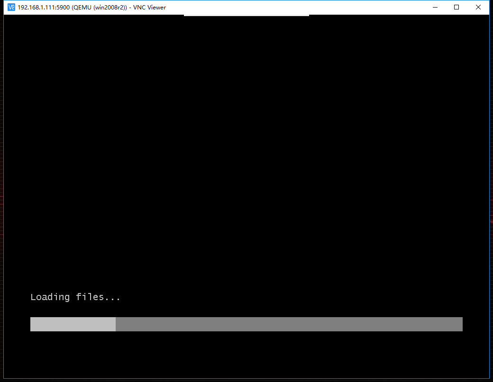
### 3.3.2 安装系统
选择带有gui的服务器，如果选择第一个的话安装完成之后图形界面只有一个powershell
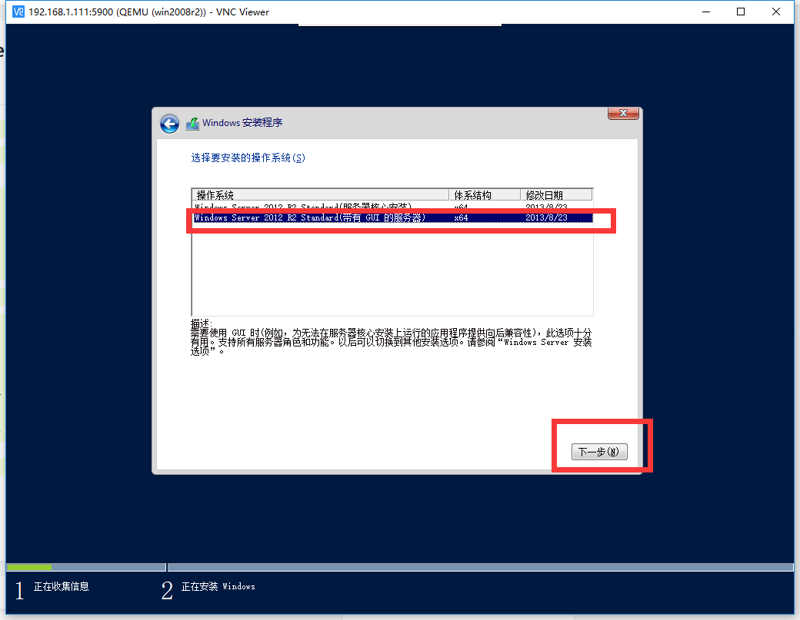
选择自定义安装
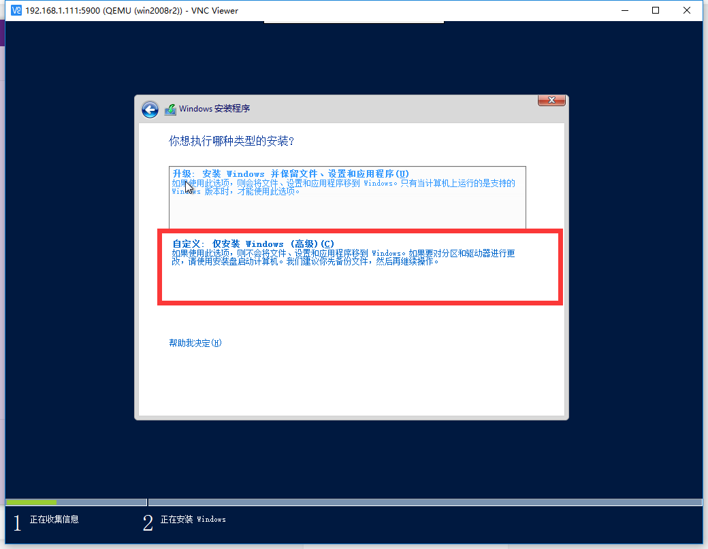
可以看到如果没有加载virtio驱动是识别不到磁盘的，进行加载
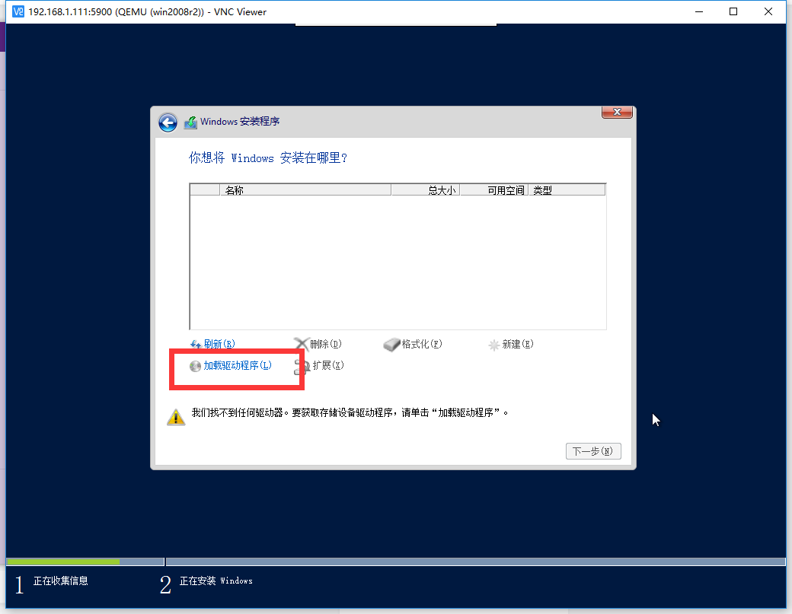
选择磁盘驱动
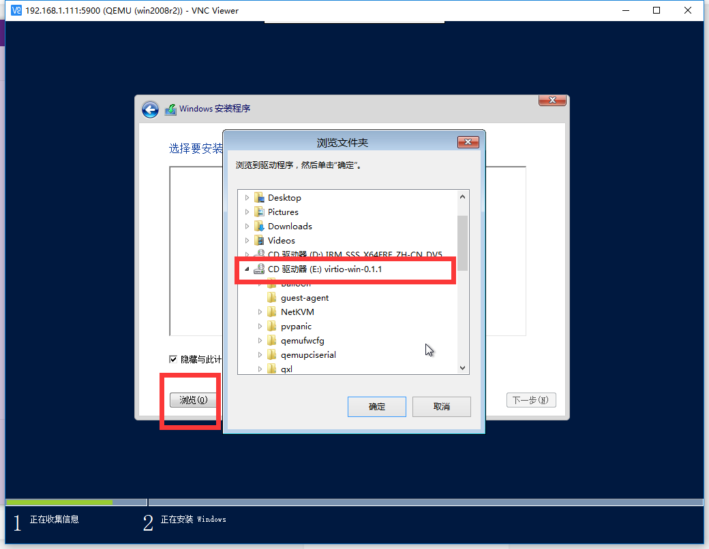
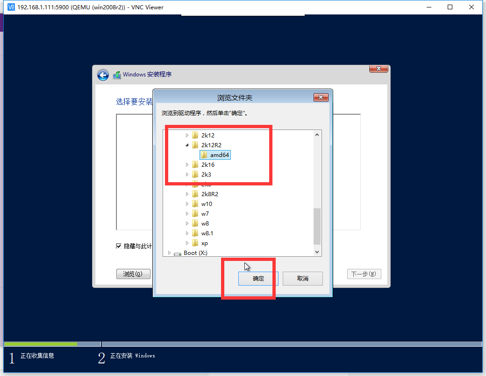
加载完磁盘驱动就可以看到磁盘了
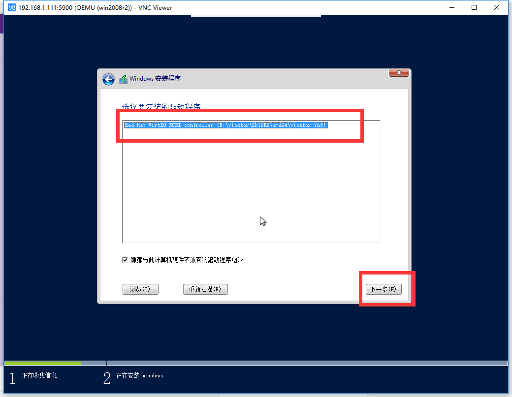
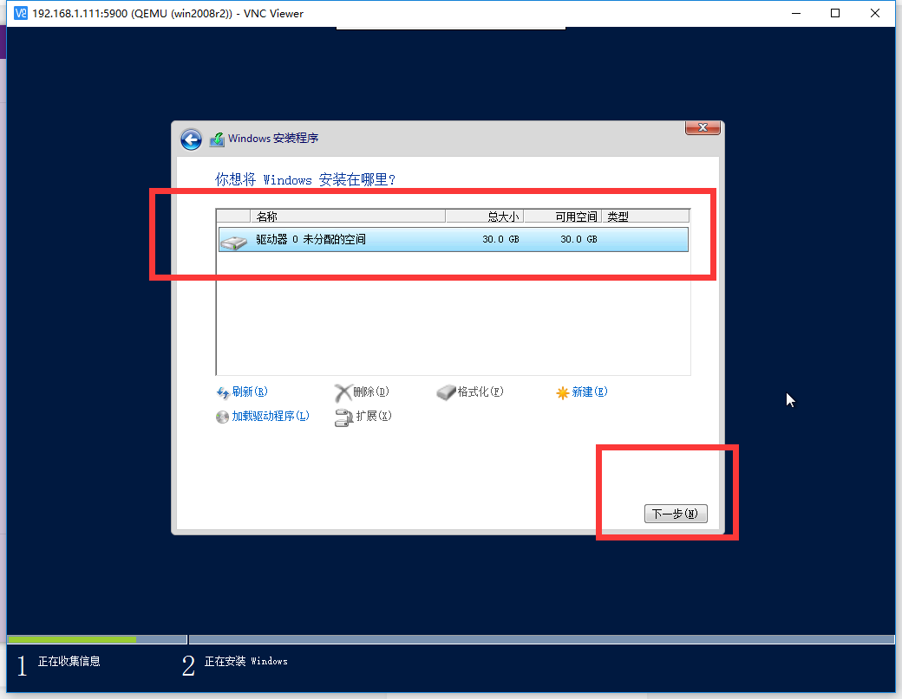
进行文件拷贝系统安装
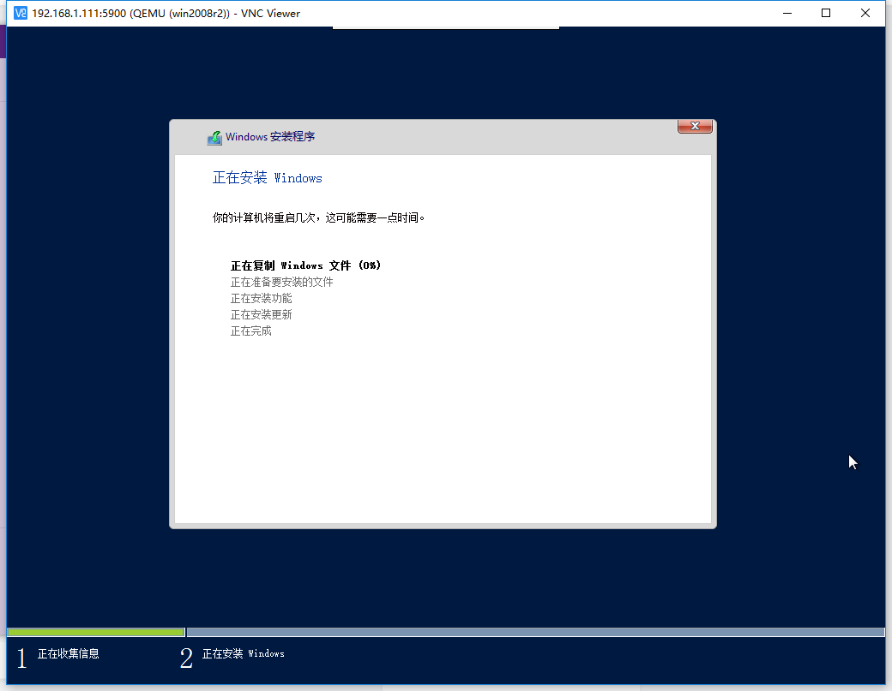
安装更新完成之后启动的镜像会重启
 ***如果拷贝中途虚拟机挂起，很可能是磁盘空间不够，需要扩容***
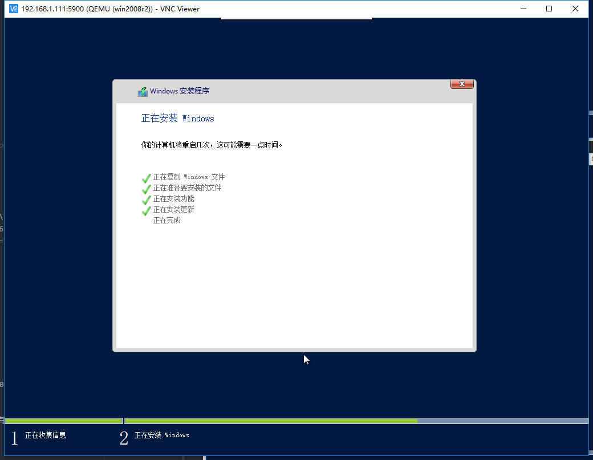
实际上是没有正常启动的
```bash
virsh # list --all
 Id    Name                           State
----------------------------------------------------
 -     win2008r2                      shut off
```
手动启动
```bash
virsh # start win2008r2
Domain win2008r2 started

```
启动之后镜像是没有网卡驱动的，打开 *设备管理器* 进行驱动安装，*浏览计算机以查找驱动程序*
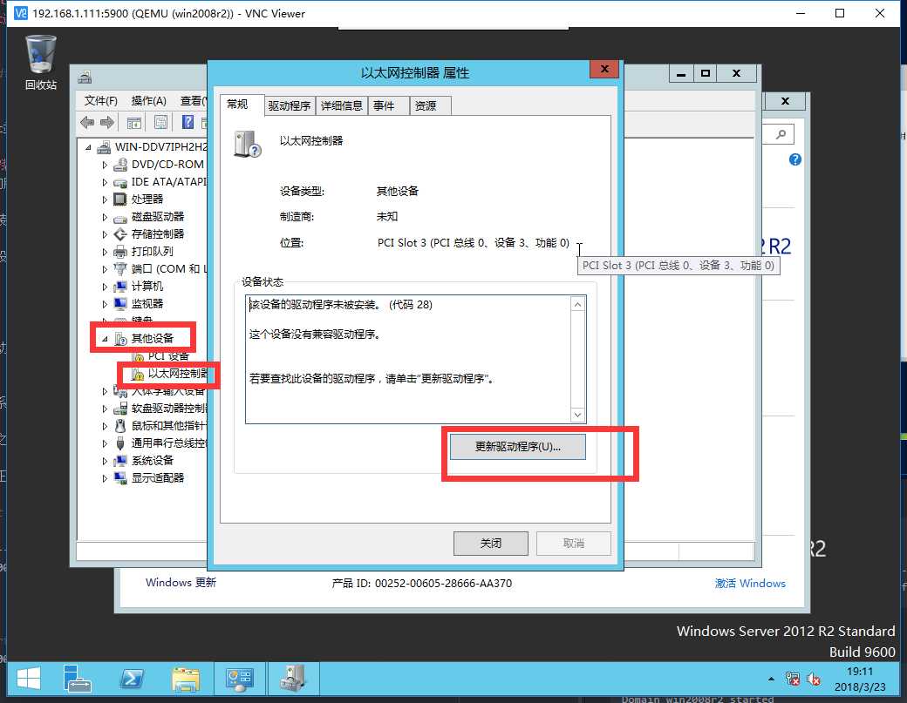
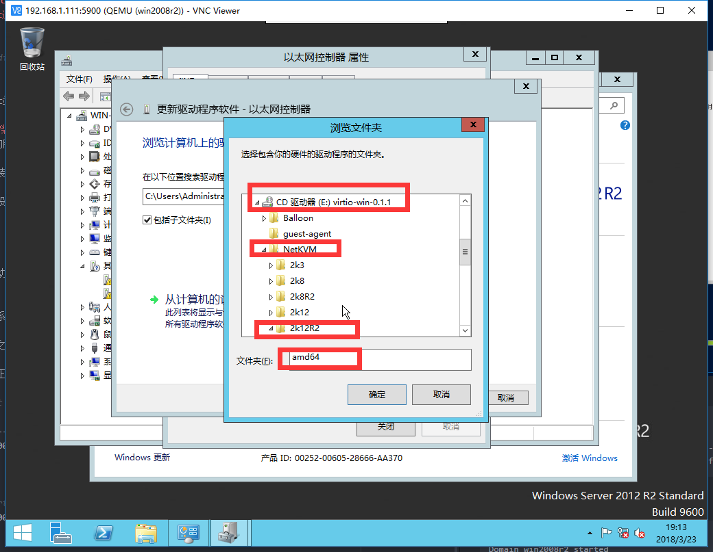
安装成功之后右下角任务栏网络连接上的小红叉就没了
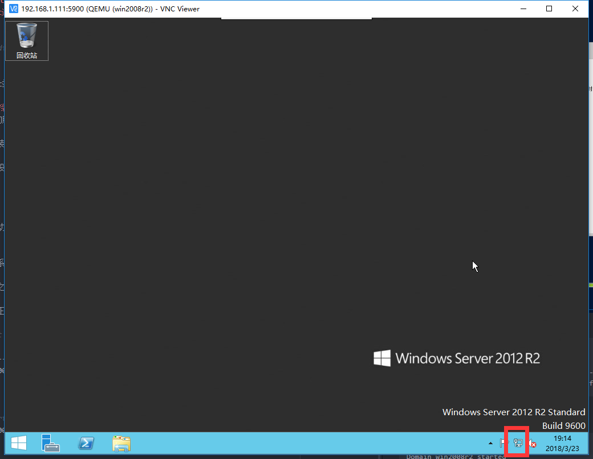
### 3.3.3 初始化
 - 例如安装agent
 - 同步时间
 - 修补漏洞
 - 关闭防火墙等操作


  初始化完成后关闭虚拟机，进行镜像压缩上传


 # 4.镜像压缩(保证磁盘空间足够)
 ## 4.1 压缩镜像
 用virt-sparsify压缩建议开机压缩，占用磁盘空间小，如果关机状态压缩的话会生成一个sparsify文件实测（22G）占用大量空间,开机状态压缩的话sparsify文件占用磁盘空间相对较小(193K)
 ```bash
# # virt-sparsify --compress /tmp/windows_server_2008r2.qcow2 \
/tmp/windows_server_2008r2_cmp.qcow2
 ```
```bash
ll -h
total 12G
-rw-r--r--. 1 root root 3.9G Mar 23 19:55 windows_server_2008r2_cmp.qcow2
-rw-r--r--. 1 qemu qemu 7.5G Mar 23 19:48 windows_server_2008r2.qcow2
```
## 4.2 压缩对比
```bash
1.-rw-r--r--. 1 root root 3.9G Mar 23 19:55 windows_server_2008r2_cmp.qcow2 #通过sparsify压缩3得到
2.-rw-r--r--. 1 root root 3.9G Mar 23 20:05 windows_server_2008r2_cmp.qcow2.tar.gz #通过tar压缩1得到
3.-rw-r--r--. 1 qemu qemu 7.5G Mar 23 19:48 windows_server_2008r2.qcow2 #原始惊醒
4.-rw-r--r--. 1 root root 3.7G Mar 23 20:13 windows_server_2008r2.qcow2.tar.gz #通过tar压缩3得到
#3为初始镜像
```
tar压缩之后占的空间比sparsify要少
```bash
# tar zcvf windows_server_2008r2.qcow2.tar.gz windows_server_2008r2.qcow2
```
## 4.3 检测
 压缩完测试下压缩之后的镜像是否可用,用压缩的镜像磁盘启动虚拟机，如果运行正常则可用
```bash
virt-install --name ws2012r2 --memory 1024  \
--disk /tmp/windows_server_2008r2_cmp.qcow2,format=qcow2 \
--import --os-type=windows --os-variant=win2k12r2  \
--disk /data/img/virtio-win-0.1.141.iso,device=cdrom,bus=ide  \
--network bridge=br0,model=virtio  \
--graphics vnc,listen=0.0.0.0 --noautoconsole
```
压缩完毕上传镜像


# 5.上传镜像(Kilo)
将镜像拷贝到glance服务器解压然后进行上传
```bash
# tar zxvf windows_server_2008r2.qcow2.tar.gz
```

```bash
# glance image-create --name 'windows_server_2008r2' \
--file=/root/img/windows_server_2008r2.qcow2 \
--disk-format qcow2 --container-format bare \
--is-public=true
```
>参考:
https://blog.csdn.net/wylfengyujiancheng/article/details/50468173
https://www.jianshu.com/p/c92c3c9a2d6f
